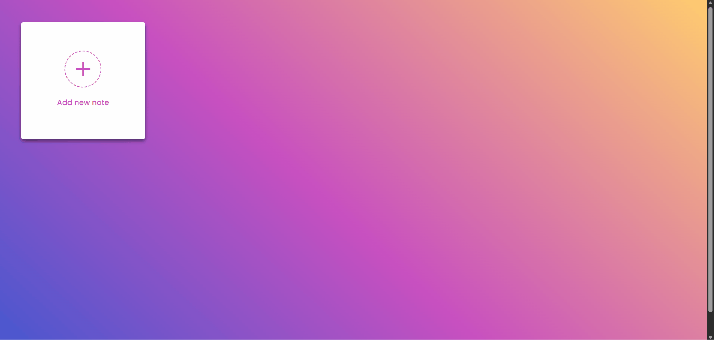

<h1 align="center">JS NoteKeeper App</h1>

JavaScript kullanılarak geliştirilmiş,
LocalStorage destekli, not ekleme, düzenleme ve silme özelliklerine sahip
modern ve tamamen responsive bir <strong>Note Taking Application</strong> çalışmasıdır.

<h2>📌 Proje Amacı</h2>

Bu proje, saf JavaScript kullanarak dinamik bir not uygulaması geliştirmek amacıyla hazırlanmıştır.
Kullanıcıların not ekleyebileceği, düzenleyebileceği ve silebileceği bir yapı kurulmuştur.
Ayrıca LocalStorage kullanılarak verilerin tarayıcıda kalıcı olması sağlanmıştır.

<ul>
<li>📝 Yeni not ekleme</li>
<li>✏️ Not düzenleme</li>
<li>🗑️ Not silme</li>
<li>📅 Otomatik tarih oluşturma</li>
<li>💾 LocalStorage ile veri kalıcılığı</li>
<li>📂 Dinamik DOM yönetimi</li>
<li>⚡ JavaScript event delegation kullanımı</li>
<li>📱 Responsive tasarım</li>
</ul>

<h2>🛠 Kullanılan Teknolojiler</h2>

<ul>
<li>HTML5</li>
<li>CSS3 (Flexbox & Grid)</li>
<li>JavaScript (Vanilla JS)</li>
<li>LocalStorage API</li>
<li>Boxicons</li>
<li>Responsive Design</li>
</ul>

<h2>⚙️ Uygulama Özellikleri</h2>

<ul>
<li>Kullanıcı istediği kadar not ekleyebilir.</li>
<li>Her not için başlık, açıklama ve tarih bilgisi tutulur.</li>
<li>Notlar düzenlenebilir ve güncellenebilir.</li>
<li>Silme işlemi için kullanıcıdan onay alınır.</li>
<li>Tüm veriler LocalStorage üzerinde saklanır.</li>
<li>Sayfa yenilense bile notlar kaybolmaz.</li>
</ul>

<h2>🎬 Demo</h2>

</img>

